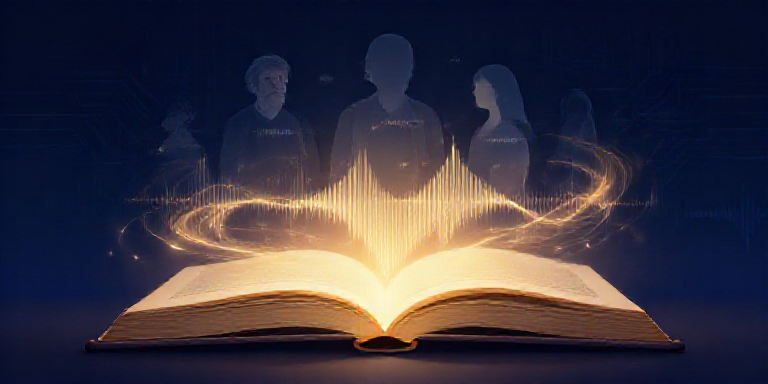

# Book Reader

Turn a book or short story into an **audiobook movie**: a multi-voice narrated
production where every character speaks in their own AI-designed voice, and the
narration plays over cinematic illustrations that slowly pan and zoom — an
audiobook you can watch.

## What it does

Give it an EPUB (or a plain `.md` / `.txt` story) and it produces:

- **`*.m4b`** — a chaptered audiobook. A narrator voice reads the prose; every
  character's dialogue is spoken in that character's own voice (Breeze TTS 2,
  voice-designed from the character's description and then cloned line-by-line
  for perfect consistency).
- **`movie/movie.mp4`** — the audiobook plus a moving picture track: every ~30
  seconds of narration gets its own cinematic illustration (Qwen-Image-2.1),
  conditioned on per-character reference portraits so faces stay consistent,
  rendered with slow Ken Burns pans and zooms so the picture never sits still.

## Pipeline

| Step | Name | Description |
|------|------|-------------|
| 1 | `extract` | EPUB → chapter text (or chapter-chunk a .md/.txt story) |
| 2 | `characters` | LLM identifies every character + physical description |
| 3 | `voices` | LLM writes a voice description per character |
| 4 | `clone` | Breeze voice-designs a reference clip per character |
| 5 | `scripts` | LLM converts chapters to speaker-attributed dialogue |
| 6 | `audio` | Breeze clones each line (batched), concatenated per chapter |
| 7 | `m4b` | Chaptered M4B with cover + chapter chimes |
| 8 | `storyboard` | ~30s scenes aligned to line boundaries + image prompts |
| 9 | `refimages` | Qwen-Image-2.1 identity portrait per character |
| 10 | `sceneimages` | Qwen-Image-2.1 16:9 still per scene, character-conditioned |
| 11 | `movie` | Ken Burns pan/zoom segments, frame-exact mux with narration |

## Usage

```bash
./run install                     # one-time: create venv + deps
./run create book.epub            # full pipeline (EPUB or .md/.txt)
./run step audio book.epub        # run a single step
./run serve                       # inspect UI
./run deploy                      # register the UI as an auto service (port 8769)
./run test <target>               # run tests
./run lint                        # ruff
```

## The inspect UI

`./run deploy` registers `book-reader-inspect` on http://127.0.0.1:8769 —
projects, pipeline progress, per-character voice clips and portraits, the
storyboard filmstrip, and inline playback of the audiobook and movie.

## Infrastructure

- **TTS**: Breeze TTS 2 via the arbiter `tts-breeze` adapter on spark
  (10.0.0.254:8400). Lines are batched 40-per-job and sliced back apart.
- **Images**: arbiter `qwen-image` (Qwen-Image-2.1, owner-sanctioned).
- **LLM**: arbiter OpenAI-compatible chat (`local-coder`).
- `BOOK_TTS_ENGINE=breeze|kokoro|qwen` selects the TTS engine (default breeze).
